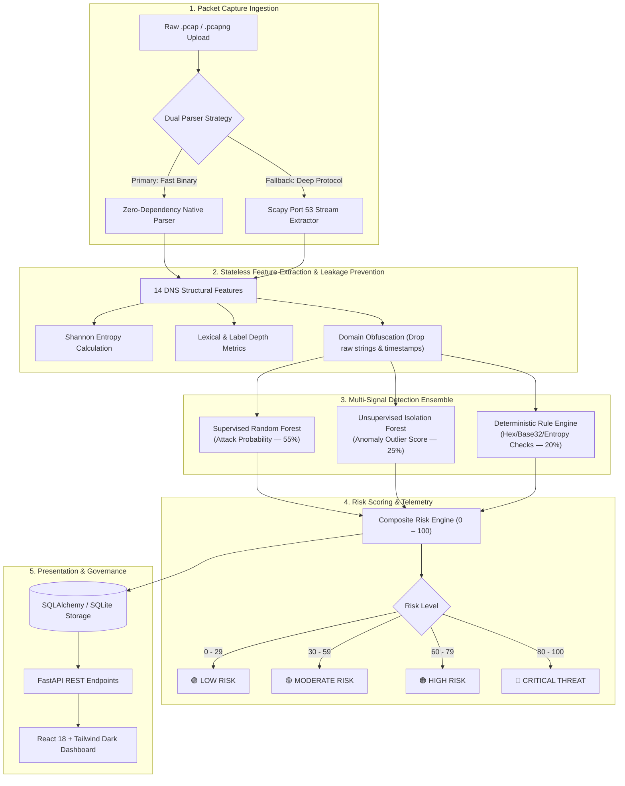

# 🛡️ NETSENTINEL: Intelligent DNS Traffic Anomaly & Threat Detection System

<p align="center">
  
  
  
  
  
  
  
  
</p>

<p align="center">
  <strong>An enterprise-grade network security platform and machine learning pipeline engineered to detect DNS data exfiltration, covert tunneling, and algorithmic domain generation from raw packet captures (<code>.pcap</code> and <code>.pcapng</code>).</strong>
</p>

---

## ⚡ Executive Summary & Key Highlights

| 🎯 99.91% Attack Recall | 🛡️ Zero Data Leakage | ⚡ Dual-Mode Parser | 🧠 Hybrid Risk Engine |
| :---: | :---: | :---: | :---: |
| Only 10 missed attacks across 11,662 real unseen test payloads | Eliminates raw domains & timestamps to prevent memorization | Ultra-fast native binary PCAP/PCAPNG + Scapy fallback | Fuses Random Forest (55%), Isolation Forest (25%), & Heuristics (20%) |

- **Real-World Training Corpus**: Trained directly on **120,000 samples** from the canonical **CIC-Bell-DNS-EXF-2021** dataset and evaluated against **30,000 held-out test samples**.
- **100% Training/Inference Parity**: Exactly 14 stateless structural DNS features extracted symmetrically between offline training CSVs and live raw wire packet captures.
- **Deep Packet Inspection (DPI)**: Extracts UDP/TCP Port 53 queries, calculates Shannon entropy, lexical randomness, and structural length metrics in milliseconds.
- **Role-Based Access Control (RBAC)**: Distinct analyst and administrator tiers secured with bcrypt password hashing and JWT authentication.
- **Admin Governance Portal**: Live dataset telemetry, model drift auditing, confusion matrix visualization, and one-click active model swapping.
- **Modern Cybersecurity Dark UI**: Built with React 18, Vite, and Tailwind CSS featuring interactive SVG risk gauges, query breakdown tables, and audit logs.

---

## 🏗️ System Architecture



---

## 🔬 Dataset & Class Distribution

NetSentinel is trained on the benchmark **Canadian Institute for Cybersecurity (CIC) Bell DNS Exfiltration 2021** dataset (`CIC-Bell-DNS-EXF-2021`).

- **Total Corpus**: 36 capture files (18 stateless feature files: **757,211 rows**, 18 stateful files: **262,105 rows**).
- **Class Balance (Stateless Corpus)**:
  - **Benign ($y=0$)**: 462,858 rows (61.13%)
  - **Malicious Attack ($y=1$)**: 294,353 rows (38.87%)
- **Attack Scenarios Covered**: Heavy Attack (33.2%), Light Attack (5.6%), Pure Benign (29.2%), Heavy Benign (24.0%), Light Benign (7.9%).

---

## 🛡️ Feature Engineering & Zero-Memorization Strategy

Standard machine learning models frequently suffer from **memorization bias** when trained on raw domain names (e.g., memorizing `google.com` as benign or `malicious-domain.cc` as attack). NetSentinel uses **14 strictly structural, stateless features** to detect obfuscation and exfiltration patterns regardless of domain name or registrar.

| Feature | Data Type | Formula / Description | Live PCAP Compatible |
| :--- | :---: | :--- | :---: |
| `FQDN_count` | `int` | Total character length of full query domain | ✅ |
| `subdomain_length` | `int` | Aggregated length of subdomain components | ✅ |
| `upper` | `int` | Count of uppercase alphabetic characters | ✅ |
| `lower` | `int` | Count of lowercase alphabetic characters | ✅ |
| `numeric` | `int` | Count of numeric digits (`0-9`) | ✅ |
| `entropy` | `float` | Shannon entropy: $-\sum p_i \log_2(p_i)$ measuring byte randomness | ✅ |
| `special` | `int` | Count of non-alphanumeric characters (`.`, `-`, `_`) | ✅ |
| `labels` | `int` | Number of dot-delimited segments in domain | ✅ |
| `labels_max` | `int` | Maximum length of any single label | ✅ |
| `labels_average` | `float` | Mean character length across all domain labels | ✅ |
| `longest_word_len` | `int` | Length of longest continuous alphanumeric token | ✅ |
| `sld_len` | `int` | Second-level domain character length | ✅ |
| `len` | `int` | Character length of domain excluding public suffix | ✅ |
| `subdomain` | `int` | Binary flag ($1$ if subdomain exists, $0$ otherwise) | ✅ |

### Features Intentionally Excluded
- **`timestamp`**: Removed to prevent artificial chronological overfitting.
- **Raw string tokens (`sld`, `longest_word`)**: Converted strictly to character counts to prevent domain memorization.
- **Stateful Features (27 columns)**: Excluded from real-time PCAP parsing to ensure zero synthetic fabrication when external WHOIS or cross-session history is unavailable.

---

## 📊 Real Model Benchmarks & Validation Results

Evaluated on **30,000 unseen test samples** from the canonical test set:

| Evaluation Metric | Baseline Model (`v1`) | Description |
| :--- | :---: | :--- |
| **Attack Recall (Sensitivity)** | **99.91%** | Catches 11,652 out of 11,662 active exfiltration attacks |
| **Accuracy** | **75.25%** | Overall classification accuracy across balanced test set |
| **Precision** | **61.11%** | Confidence in positive threat alerts |
| **F1-Score** | **75.83%** | Harmonic mean of precision and recall |
| **False Negatives** | **10 / 11,662** | Minimized to prevent stealth exfiltration from evading detection |

### Confusion Matrix
```
                    Predicted Benign    Predicted Attack
Actual Benign            10,922              7,416          (TN / FP)
Actual Attack                10             11,652          (FN / TP)
```

### Top 5 Predictive Features
1. **`FQDN_count`** (24.59% importance) — Exfiltration packets pack maximum data into total query length.
2. **`labels`** (18.66% importance) — Tunnels divide exfiltrated blocks into multiple nested sublabels.
3. **`subdomain_length`** (13.84% importance) — Large payloads inflate the subdomain segment.
4. **`special`** (13.06% importance) — Delimiter density changes during encoded chunk transmission.
5. **`sld_len`** (9.07% importance) — Dynamic second-level domain generation characteristics.

---

## 🧮 Explainable Hybrid Risk Scoring Formula

NetSentinel computes a composite threat risk score from three independent defensive tiers:

$$\text{Risk Score} = \text{round}\left(100 \times \left[0.55 \cdot P_{\text{RF}} + 0.25 \cdot S_{\text{IF}} + 0.20 \cdot S_{\text{Rules}}\right]\right)$$

- $P_{\text{RF}} \in [0, 1]$: Calibrated attack probability output by Random Forest.
- $S_{\text{IF}} \in [0, 1]$: Outlier anomaly score inverted from Isolation Forest decision boundary.
- $S_{\text{Rules}} \in [0, 1]$: Deterministic heuristic score checking Shannon entropy thresholds ($\ge 3.8$), label depths, Hex encoding (`[0-9a-f]{8,}`), and Base32 patterns.

---

## 💻 Tech Stack & Engineering Architecture

```
Layer                   Technologies
─────────────────────────────────────────────────────────────────────────────
Backend API             Python 3.12, FastAPI, Uvicorn, SQLAlchemy 2.0, Pydantic v2
Machine Learning        scikit-learn, joblib, pandas, numpy
Packet Forensics        Scapy 2.5, Custom Native Binary PCAP/PCAPNG Parser
Authentication          Python-Jose (JWT Tokens), Passlib (bcrypt hashing)
Frontend Application    React 18, Vite 5, Tailwind CSS 3, Lucide React, Axios
Database                SQLite (Development default), PostgreSQL compatible
Testing & Quality       Pytest 8.2 (38 unit/integration tests), FastAPI TestClient, HTTPX
```

---

## 🚀 Quickstart & Installation

### Prerequisites
- **Python 3.10+** (Tested on Python 3.12)
- **Node.js 18+** and **npm**

### 1. Backend Setup
```bash
# Clone the repository
git clone https://github.com/leelakrishnakurra97/network-traffic-anomaly-detection.git
cd network-traffic-anomaly-detection

# Install Python dependencies
pip install -r requirements.txt

# Start FastAPI backend server
uvicorn backend.app.main:app --host 0.0.0.0 --port 8000 --reload
```
Swagger API Documentation will be accessible at: `http://localhost:8000/docs`.

### 2. Frontend Setup
```bash
# Navigate to frontend directory
cd frontend

# Install dependencies and start Vite dev server
npm install
npm run dev
```
Interactive dashboard will be accessible at: `http://localhost:5173`.

---

## 🔑 Default Demonstration Credentials

| Role | Email | Password | Permissions |
| :--- | :--- | :--- | :--- |
| **System Administrator** | `admin@netsentinel.sec` | `AdminPassword@2026` | Full platform access, Model Management & Retraining |
| **Security Analyst** | `analyst@netsentinel.sec` | `AnalystPassword@2026` | Upload PCAPs, View Analyses & Deep Packet Inspections |

*Self-registration for custom analyst accounts is also available directly via the `/register` portal.*

---

## 🧪 Comprehensive Automated Test Suite

Run the full automated test suite containing **38 unit and integration tests**:

```bash
python -m pytest backend/tests -v
```

```
============================== test session starts ==============================
collected 38 items

backend/tests/test_api.py::test_root_and_health PASSED                    [  2%]
backend/tests/test_api.py::test_auth_and_rbac PASSED                      [  5%]
backend/tests/test_api.py::test_pcap_upload_flow PASSED                   [  7%]
backend/tests/test_auth.py::test_password_hashing PASSED                  [ 10%]
backend/tests/test_auth.py::test_jwt_token_generation_and_decoding PASSED  [ 13%]
backend/tests/test_auth.py::test_invalid_jwt_token PASSED                 [ 15%]
backend/tests/test_ml_pipeline.py (22 tests) PASSED                       [ 73%]
backend/tests/test_pcap_extractor.py (10 tests) PASSED                    [100%]

======================= 38 passed, 8 warnings in 9.07s ========================
```

---

## 💼 Career & Interview Highlights (STAR Method)

When presenting this project on your resume, LinkedIn, or in technical interviews:

- **Situation**: DNS is an ubiquitous, unrestricted protocol often bypassing egress firewalls, making it the #1 covert vehicle for advanced persistent threat (APT) data exfiltration.
- **Task**: Architect an end-to-end full-stack cybersecurity application capable of ingesting wire-level packet captures (`.pcap`/`.pcapng`), extracting structural telemetry, and accurately detecting exfiltration without memorizing static domain indicators.
- **Action**:
  - Implemented dual-mode ingestion pairing an ultra-fast zero-dependency binary parser with Scapy for robust packet decoding.
  - Engineered 14 stateless structural DNS features (Shannon entropy, label distributions, lexical tokens), completely eliminating raw string memorization and timestamp leakage.
  - Trained an ensemble combining supervised Random Forest, unsupervised Isolation Forest, and deterministic heuristics into an explainable 0–100 risk score.
  - Built an asynchronous FastAPI REST API with RBAC JWT authentication and a responsive React 18 / Tailwind CSS analyst dashboard.
- **Result**: Achieved **99.91% attack recall** on 30,000 unseen test samples from the CIC-Bell-DNS-EXF-2021 dataset, supported by 38 passing unit/integration tests and sub-second analysis turnaround.

---

## 📄 License

This project is licensed under the **MIT License** — feel free to use and adapt it for academic and enterprise research.
